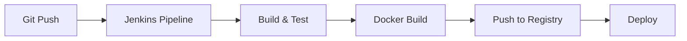

## 📋 Overview
This repository contains a complete CI/CD pipeline implementation for a Java application using Jenkins and Docker. The pipeline automates building, testing, and deploying the application while following DevOps best practices.

## 🚀 Features
- Automated build and test process
- Docker containerization
- Continuous Integration with Jenkins
- Automated deployment
- Docker Hub integration
- Environment configuration management
- Security best practices implementation

## 🏗️ Architecture


## 🛠️ Prerequisites
- Java 21
- Jenkins
- Docker
- Maven
- Git
- Docker Hub account

## 📦 Installation

### 1. Clone the Repository
```bash
git clone https://github.com/{username}/{repository}.git
cd {repository}
```

### 2. Configure Jenkins
1. Install required plugins:
   - Docker Pipeline
   - Git plugin
   - Maven Integration
   - Pipeline
   - Credentials Binding

2. Add credentials:
   - Docker Hub credentials
   - Git credentials (if private repository)

### 3. Configure Docker Hub
```bash
docker login
```

## 🔧 Configuration

### Jenkins Pipeline Configuration
Create a new Pipeline job in Jenkins and use the following configuration:

1. Pipeline Script from SCM:
   - SCM: Git
   - Repository URL: `https://github.com/{username}/{repository}.git`
   - Script Path: `Jenkinsfile`

### Environment Variables
Configure the following environment variables in Jenkins:
```groovy
environment {
    DOCKER_CREDENTIALS_ID = 'docker-hub-credentials'
    DOCKER_IMAGE = 'username/repository:${BUILD_NUMBER}'
    JAVA_HOME = '/usr/lib/jvm/java-21-openjdk'
}
```

## 📝 Usage

### Running Locally
1. Build the application:
```bash
mvn clean package
```

2. Build Docker image:
```bash
docker build -t myapp .
```

3. Run the container:
```bash
docker run -p 8080:8080 myapp
```

### Running with Jenkins
1. Access Jenkins dashboard
2. Navigate to your pipeline
3. Click "Build Now"

## 📂 Project Structure
```
├── src/
│   ├── main/
│   │   └── java/
│   └── test/
│       └── java/
├── Dockerfile
├── Jenkinsfile
├── pom.xml
├── docker-compose.yml
└── README.md
```

## 🔑 Key Files

### Dockerfile
```dockerfile
FROM openjdk:21
WORKDIR /app
COPY target/*.jar app.jar
EXPOSE 8080
ENTRYPOINT ["java", "-jar", "app.jar"]
```

### Jenkinsfile
```groovy
pipeline {
    agent any
    stages {
        stage('Build') {
            steps {
                sh 'mvn clean package'
            }
        }
       
    }
}
```

## 🚢 Deployment

### Production Deployment
1. Ensure all tests pass
2. Merge to main branch
3. Jenkins will automatically:
   - Build the application
   - Create Docker image
   - Push to Docker Hub
   - Deploy to production

### Manual Deployment
```bash
docker pull {username}/{repository}:latest
docker run -d -p 8080:8080 {username}/{repository}:latest
```

## 🧪 Testing
Run tests using Maven:
```bash
mvn test
```

## 📊 Monitoring
- Application health check: `http://localhost:8080/health`
- Jenkins pipeline status: Available in Jenkins dashboard
- Docker container status: `docker ps`

## 🔐 Security
- Sensitive data stored in Jenkins credentials
- Docker images regularly scanned for vulnerabilities
- HTTPS enabled for all endpoints
- Regular dependency updates

## 🤝 Contributing
1. Fork the repository
2. Create a feature branch
3. Commit your changes
4. Push to the branch
5. Create a Pull Request

## 📜 License
This project is licensed under the MIT License - see the [LICENSE](LICENSE) file for details.

## 📞 Support
- Create an issue in the repository
- Contact the development team
- Check the [Wiki](wiki) for additional documentation

## 🙏 Acknowledgments
- Jenkins community
- Docker community
- Spring Boot framework
- Maven project

## 📚 Additional Resources
- [Jenkins Documentation](https://www.jenkins.io/doc/)
- [Docker Documentation](https://docs.docker.com/)
- [Spring Boot Documentation](https://spring.io/projects/spring-boot)
- [Maven Documentation](https://maven.apache.org/guides/)
